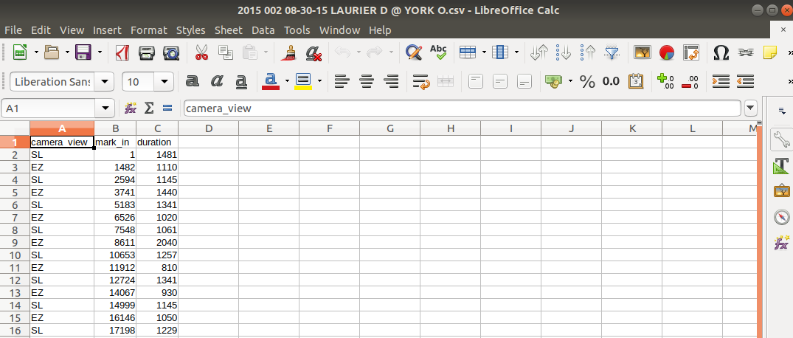
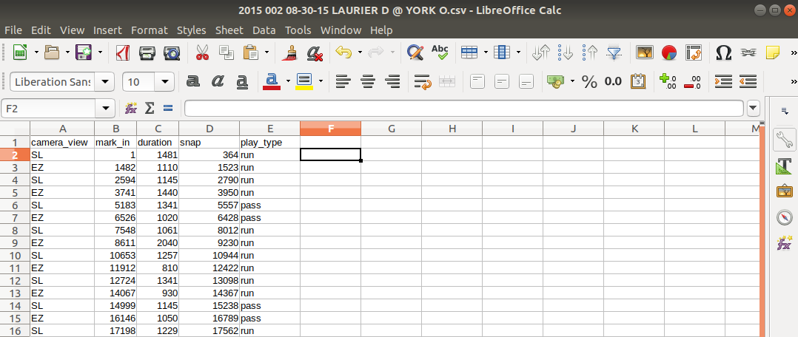
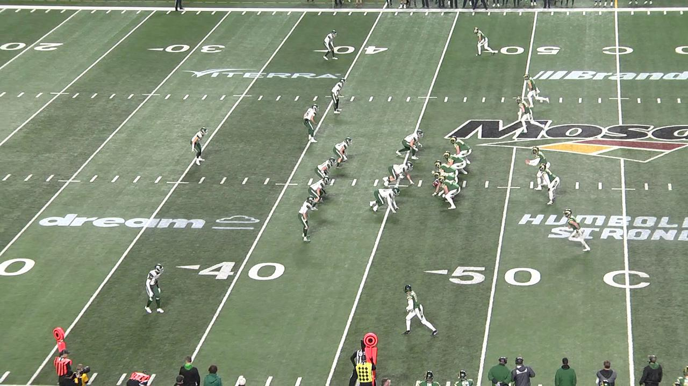
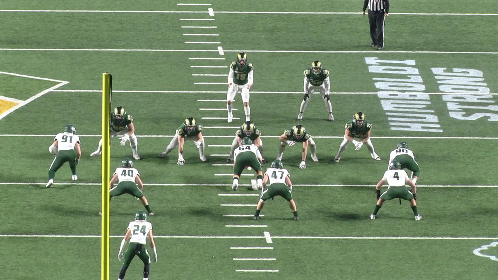
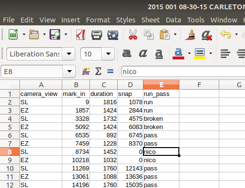

# Where to find the files you will need

## The videos

The videos I need you to annotate are found at...

Each video has a frame counter running at the bottom of the screen which you can use to make your annotations (e.g. to mark when a play starts we will use the frame number).

Each videos corresponding .csv file has the same name but without "\_fps.mp4" and just ".csv" instead. For example, if you are annotating `2015 002 08-30-15 LAURIER D @ YORK O_fps.mp4` the corresponding .csv is titled `2015 002 08-30-15 LAURIER D @ YORK O.csv`. The .csv files already exists for each video with some annotations already recorded. You can find the ones I need you to update at...

To see which videos still need to be done, or are already done, see ... Simply pick one that has the ...

# The .csv's

A .csv file already exists for each video that needs to be annotated. For example, `2015 002 08-30-15 LAURIER D @ YORK O.csv` will already contain the fields:  
* **camera_view**: denotes if the camera is from the sideline (SL) or endzone (EZ)
* **mark_in**: denotes the frame number of when the clip begins
* **duration**: denotes how many frames long the clip is

I need you to add two new fields:  
* **snap**: denotes the frame number of when the ball is snapped (when the play starts)
* **play_type**: denotes the type of play, usually if it was a run or pass play

### camera_view

You will see each play twice, back-to-back. First you will see it from the side (SL) and then you will see it from the end (EZ).

SL stands for sideline and is the same view you would get if you watched a game of football on t.v.:

EZ stands for endzone and is the view you get when a camera is placed in the endzone:

These fields are already filled in for you, but make sure that you fill the `play_type` field the same for each SL-EZ pair since the play is the same no matter what the camera angle is.

### snap

For determining when the snap occurs (when the play begins), try to get the frame where the center has hiked the ball completely through his legs and the offensive line has just started to move. Sometimes you will get a clear view of the center which makes this pretty easy:

Other times your view of the ball is not so clear. In these cases you just simply do your best by going off of when the offensive line starts to move and when the receivers cross the line of scrimmage (when they start to cross over onto the defenses side of the field).

The exact moment a ball is technically snapped is a little subjective and these videos run at about 60 fps so don't stress too much over annotating things to be exactly frame perfect. If you are unsure if you are annotating correctly just ask me and I can come do a couple with you.

### play_type

Enter one of the following six strings for the `play_type` field:  
* **"run"**: When the quarterback hands the ball off to the runningback
* **"pass"**: When the quarterback attempts to pass the ball*
* **"play action"**: When the quarterback first pretends to hand the ball off and then attempts to pass the ball*
* **"broken"**: This is usually when there is a penalty *before* the ball is snapped and the play is stopped before it begins
* **"late"**: When the clip begins after the play has already started and you never got to see the snap (this is rare)
* **"missing"**: Sometimes the film will go blank and have "NO FILM DETECTED" written on the screen, or sometimes a team calls a timeout and no play happens in the clip

\***IMPORTANT**: Sometimes a quarterback is tackled before they are able to throw the ball, other times the quartback may take off running if there is no open receiver to throw the ball to. On an official game stats sheet these plays are recorded as running plays; *however*, for the purposes of film analysis these are considered pass plays and should be annotated as such.

Examples of each of the above play types can be found ...

For plays you label as "broken", "late", or "missing", you can simply set the `snap` field to `0`.

# What to do if you are unsure about a play

Sometimes you may be unsure about when the ball is snapped or how you should label a play type. Perhaps a scenario arises that I didn't cover above, or the play is hard to see, or you simply are not confident in what to put. In this case just set `snap` to `0` and `play_type` to "nico", and then create a new csv that is `filename_uncertain_plays.csv` that contains the `mark_in` frame and I will go back and check it out myself.

For example, if you are annotating `2015 002 08-30-15 LAURIER D @ YORK O_fps.mp4` and are thus saving your annotations in `2015 002 08-30-15 LAURIER D @ YORK O.csv`, then you would make a new csv titled `2015 002 08-30-15 LAURIER D @ YORK O_uncertain_plays.csv` that would look something like the following:

And then send me the csv with all the `mark_in`'s of the plays that you are uncertain about.

Even if in one video of about 150 play clips you have many plays you are uncertain of that is fine. Just make sure to mark which ones and let me know so I can go back and fill them in.

# Software

So far these annotations have been a very manual process for myself. I have been using VLC to watch the videos at 1.5-2x speed and then when I think the ball is about to be snapped I pause the video and start advancing it frame-by-frame until I think I have reached when the ball is snapped and then I jot down the frame number from the frame counter at the bottom of the video. I usually have the .csv file open in a spreadsheet program like LibreOffice Calc to update the .csv.

If you have or know of some better video annotation software then do not hesitate to let me know.
