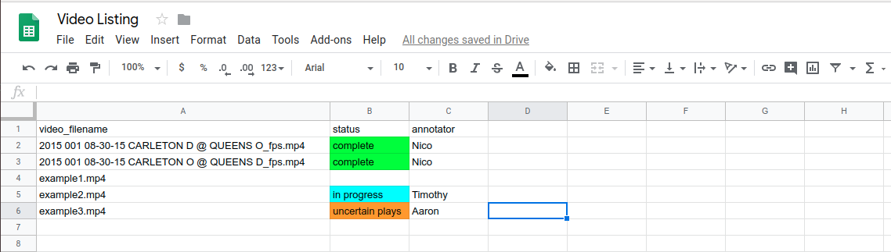
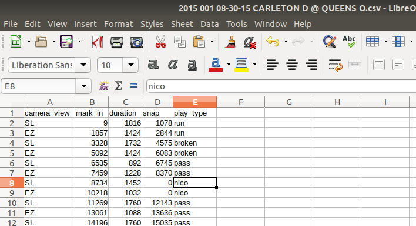

# Where to find the files you will need

Everything you will need is found on the shared [P2IRC-3.2-Large-Data google drive](https://drive.google.com/drive/folders/1Gry1fBY-Zt3PON8am0m_ZqdEa1XxYCIr) in the [football_annotations folder](https://drive.google.com/drive/folders/1aA9OeEyU0iQU-o-ruRSbl9hS8tOyHyBX):  
* [video_listings](https://docs.google.com/spreadsheets/d/1--J-V-IeR8Mg0sCicFUQ9nRRf2V6dGGJcpy6MKpZduk/edit#gid=0) is the google sheet that maintains the list of videos that are completed or still need to be annotated.
* [videos](https://drive.google.com/drive/folders/161gMdc67Z-LwqDaYOl8ise1zT-Kvr_h_) contains all the videos.
* [original_csvs](https://drive.google.com/drive/folders/1ZxB8k8svso_VQvIKd4LWVIiTvSOqMAy0) contains the old .csvs I need you to update.
* [updated_csvs](https://drive.google.com/drive/folders/1RU9D5PqudHx3e_W-sLaYusQsUidmZ8cQ) is where you need to save/upload the final updated .csv with all your new annotations.
* [example_plays](https://drive.google.com/drive/folders/1IBApzluRm4MvAf3Hoh7Lix0MuhU9xfxq) contains some examples of each `play_type`.
* [link_to_guide](https://docs.google.com/document/d/1wDJunhYyONL2we0IU8kCV8nN6jqxqDmEBG8X3SILgLs/edit) a google doc that has a link to this page.

## video_listings

To see which videos still need to be done, or are already done, see the [video_listings google sheet](https://docs.google.com/spreadsheets/d/1--J-V-IeR8Mg0sCicFUQ9nRRf2V6dGGJcpy6MKpZduk/edit#gid=0).

Check the `status` column to see which videos are available for you to annotate. Look for a video that has the `status` column blank, and be sure to fill it in with "in progress", and also fill in the `annotator` column with your name, so that no one else starts to annotate the same video as you. In the example below, "example1.mp4" would be available for you to annotate.

If you finish with no uncertain plays then make the status "complete", otherwise set the status to "uncertain plays" so that I know you are finished but you need me to look over some of the plays (more on what to do when you are uncertain of a play below).

## videos

The videos can be found in the [videos folder](https://drive.google.com/drive/folders/161gMdc67Z-LwqDaYOl8ise1zT-Kvr_h_).

Each video has a frame counter running at the bottom of the screen which you can use to make your annotations (e.g. to mark when a play starts we will use the frame number).

Each video has a corresponding .csv file that has the same name but without "\_fps.mp4" and just ".csv" instead. For example, if you are annotating `2015 002 08-30-15 LAURIER D @ YORK O_fps.mp4` the corresponding .csv is titled `2015 002 08-30-15 LAURIER D @ YORK O.csv`.

## .csvs

The .csvs I need you to update are found in the [original_csvs folder](https://drive.google.com/drive/folders/1ZxB8k8svso_VQvIKd4LWVIiTvSOqMAy0). Download the one you need, update it as I describe below, and then save/upload it to the [updated_csvs folder](https://drive.google.com/drive/folders/1RU9D5PqudHx3e_W-sLaYusQsUidmZ8cQ) with the same filename.

A .csv file already exists for each video that needs to be annotated. For example, `2015 002 08-30-15 LAURIER D @ YORK O.csv` will already contain the fields:  
* **camera_view**: denotes if the camera is from the sideline (SL) or endzone (EZ).
* **mark_in**: denotes the frame number of when the clip begins.
* **duration**: denotes how many frames long the clip is.

I need you to add two new fields:  
* **snap**: denotes the frame number of when the ball is snapped (when the play starts).
* **play_type**: denotes the type of play, usually if it was a run or pass play.

### camera_view

You will see each play twice, back-to-back. First you will see it from the side (SL) and then you will see it from the end (EZ).

SL stands for sideline and is the same view you would get if you watched a game of football on t.v.:

EZ stands for endzone and is the view you get when a camera is placed in the endzone:

These fields are already filled in for you, but make sure that you fill the `play_type` field the same for each SL-EZ pair since the play is the same no matter what the camera angle is.

### snap

For determining when the snap occurs (when the play begins), try to get the frame where the center has hiked the ball completely through his legs and the offensive line has just started to move. Sometimes you will get a clear view of the center which makes this pretty easy.

Other times your view of the ball is not so clear. In these cases you just simply do your best by going off of when the offensive line starts to move and when the receivers cross the line of scrimmage (when they start to cross over onto the defenses side of the field).

The exact moment a ball is "snapped" is a little subjective and these videos run at about 60 fps so don't stress too much over annotating things to be exactly frame perfect. If you are unsure if you are annotating correctly just ask me and I can come do a couple with you.

### play_type

Examples of each of the following play types can be found in the [example_plays folder](https://drive.google.com/drive/folders/1IBApzluRm4MvAf3Hoh7Lix0MuhU9xfxq).

Enter one of the following seven strings for the `play_type` field:  
* **"run"**: When the quarterback hands the ball off to the runningback. Sometimes it is a short toss or shovel pass instead of a hand off, and sometimes it is handed off to a receiver.
* **"pass"**: When the quarterback attempts to pass the ball1.
* **"play action"**: When the quarterback first pretends to hand the ball off and then attempts to pass the ball1.
* **"fumbled snap"**: When the ball is dropped during the snap and it becomes a mad scramble to just jump on the ball and the play never really takes effect.
* **"knee"**: When the quarterback intentionally drops one knee to the ground as soon as he gets the ball. This happens at the end of the game if the offensive team is winning, or sometimes just before half time.
* **"broken"**: This is a catch-all for when a play never really happens. The most common is when there is a penalty *before* the ball is snapped and the play is stopped2. Sometimes the film will go blank and have "NO FILM DETECTED" written on the screen, or sometimes a team calls a timeout and no play happens in the clip.
* **"late"**: When the clip begins after the play has already started and you never got to see the snap (this is rare).

1**IMPORTANT**: Sometimes the quarterback is tackled before they are able to throw the ball, other times the quarterback may take off running if there is no open receiver to throw the ball to. On an official game stats sheet these plays are recorded as running plays; *however*, for the purposes of film analysis these are considered pass plays and should be annotated as such.  
With the above said, there do exist plays that are designed for the quartback to run the ball (e.g. qb sneak, option, qb draw), but in general when the quartback looks to pass and then takes off running we will label these as pass plays. If you are uncertain then just ask me to come take a look (more on what to do if you are uncertain below).

2If a penalty occurs during the play that is fine; ignore it and treat the play as normal. It is only when the penalty happens before the snap and the play is stopped that I need it labelled differently.

For plays you label as "broken" or "late", you can simply set the `snap` field to 0.

# What to do if you are uncertain about a play

Sometimes you may be uncertain about when the ball is snapped or how you should label a play type. Perhaps a scenario arises that I didn't cover above, or the play is hard to see, or you simply are not confident in what to put. In these cases just set `snap` to 0 and `play_type` to "nico" so that when you are finished I can find which plays you were uncertain of from your newly saved/uploaded .csv.

Even if in one video you have many plays you are uncertain of that is fine. Just make sure to mark the plays you are uncertain of and let me know so I can go back and fill them in (i.e. set the `status` column in the video_listings google sheet to "uncertain plays" and upload your completed .csv that has uncertain plays labelled as "nico" to the updated_csvs folder so that I know which plays to double check for you).

# Software

So far these annotations have been a very manual process for myself. I have been using VLC to watch the videos at 1.5-2x speed and then when I think the ball is about to be snapped I pause the video and start advancing it frame-by-frame until I think I have reached when the ball is snapped and then I jot down the frame number from the frame counter at the bottom of the video. I usually have the .csv file open in a spreadsheet program like LibreOffice Calc to update the .csv.

If you have or know of some better video annotation software then do not hesitate to let me know.
